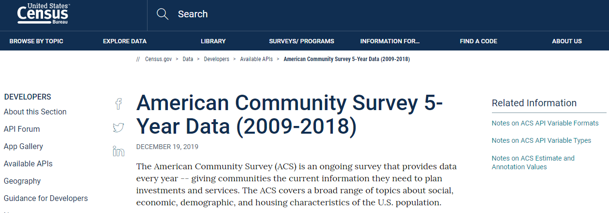

Project Title

Project Description

Extraction  - Extract: your original data sources and how the data was formatted (CSV, JSON, pgAdmin 4, etc).
- Open Weather Now (API)
- Indiana Home Sales (Kaggle csv)
- U.S. Census (API)
    - The extracted housing related data source was the U.S. Census and was aquired using an API. The data set selected was from was the 2018 American Community Survey 5-Year Survey.
    

Transform  - Transform: what data cleaning or transformation was required.
-
-
-

Load  - Load: the final database, tables/collections, and why this was chosen.
-
-
-

